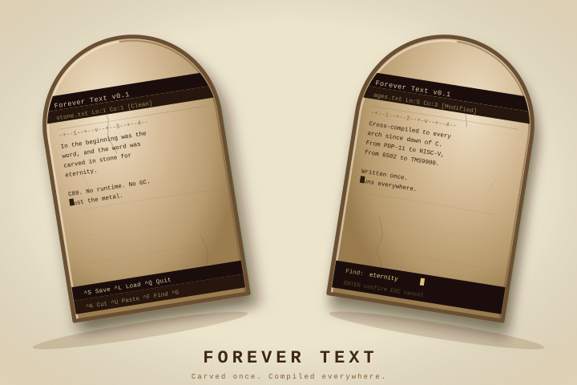

# Forever Text

<p align="center">
  
</p>

<p align="center">
  <a href="https://buymeacoffee.com/sormondocom">
    
  </a>
</p>

A screen-oriented text editor written in strict C89, designed to compile and
run on the widest possible range of computer architectures — from 1970s
minicomputers through modern silicon.

---

## Build Status

| Pipeline | Status |
|---|---|
| Native Linux (x86-64) + feature proof | [](https://github.com/sormondocom/forever-text/actions/workflows/ci-native.yml) |
| Windows x86-64 + i686 (MinGW cross-compile) | [](https://github.com/sormondocom/forever-text/actions/workflows/ci-windows.yml) |
| macOS ARM64 + x86-64 (Apple Clang, native) | [](https://github.com/sormondocom/forever-text/actions/workflows/ci-macos.yml) |
| POSIX cross-compile + QEMU tests (10 arches) | [](https://github.com/sormondocom/forever-text/actions/workflows/ci-posix.yml) |
| DOS 16-bit (ia16) + DOS 32-bit (DJGPP) | [](https://github.com/sormondocom/forever-text/actions/workflows/ci-dos.yml) |
| 6502: Commodore 64 / Atari 8-bit / Apple II | [](https://github.com/sormondocom/forever-text/actions/workflows/ci-6502.yml) |
| Amiga 68k (amiga-gcc) | [](https://github.com/sormondocom/forever-text/actions/workflows/ci-amiga.yml) |
| Atari ST MiNT (m68k-atari-mint-gcc) | [](https://github.com/sormondocom/forever-text/actions/workflows/ci-atarist.yml) |
| TRS-80 Model III Z80 (SDCC) | [](https://github.com/sormondocom/forever-text/actions/workflows/ci-trs80.yml) |
| TI-99/4A TMS9900 (Experimental ⚠) | [](https://github.com/sormondocom/forever-text/actions/workflows/ci-ti99.yml) |

**Latest build on `main`:** commit `11df5f86` · [view release →](https://github.com/sormondocom/forever-text/releases/tag/latest)

---

## Screenshots

All screenshots are captured automatically on every push to `main`.
The 8-character commit hash visible inside each image matches the hash above.

### Desktop and DOS

| Linux x86-64 | macOS Apple Silicon |
|---|---|
| [](https://github.com/sormondocom/forever-text/releases/download/latest/screenshot-linux-11df5f86.png) | [](https://github.com/sormondocom/forever-text/releases/download/latest/screenshot-macos-11df5f86.png) |

| DOS 16-bit real mode | DOS 32-bit protected mode |
|---|---|
| [](https://github.com/sormondocom/forever-text/releases/download/latest/screenshot-dos16-11df5f86.png) | [](https://github.com/sormondocom/forever-text/releases/download/latest/screenshot-dos32-11df5f86.png) |

### 8-bit and Vintage

| Commodore 64 | Atari 400/800/XL/XE | Apple IIe enhanced |
|---|---|---|
| [](https://github.com/sormondocom/forever-text/releases/download/latest/screenshot-c64-11df5f86.png) | [](https://github.com/sormondocom/forever-text/releases/download/latest/screenshot-atari8-11df5f86.png) | [](https://github.com/sormondocom/forever-text/releases/download/latest/screenshot-apple2-11df5f86.png) |

| Amiga 68k | Atari ST | TRS-80 Model III | TI-99/4A |
|---|---|---|---|
| [](https://github.com/sormondocom/forever-text/releases/download/latest/screenshot-amiga-11df5f86.png) | [](https://github.com/sormondocom/forever-text/releases/download/latest/screenshot-atarist-11df5f86.png) | [](https://github.com/sormondocom/forever-text/releases/download/latest/screenshot-trs80-11df5f86.png) | [](https://github.com/sormondocom/forever-text/releases/download/latest/screenshot-ti99-11df5f86.png) |

---

## Platform Matrix

Every push to `main` builds all targets, runs the 74-test buffer suite where
the platform supports it, and publishes the results to the
[latest rolling release](https://github.com/sormondocom/forever-text/releases/tag/latest).
**A screenshot in the release is proof that tests passed** — the screenshot
step only runs after the test step succeeds.

### Desktop, Server, and DOS

| Platform | Architecture | Tests | Results |
|---|---|---|---|
| Linux x86-64 | x86-64 | 74/74 — native | [test-results-linux.txt](https://github.com/sormondocom/forever-text/releases/download/latest/test-results-linux.txt) |
| macOS Apple Silicon | AArch64 | 74/74 — native | [test-results-macos.txt](https://github.com/sormondocom/forever-text/releases/download/latest/test-results-macos.txt) |
| DOS 16-bit real mode | 8086 | 74/74 — in DOSBox | [test-results-dos16.txt](https://github.com/sormondocom/forever-text/releases/download/latest/test-results-dos16.txt) |
| DOS 32-bit protected mode | 386 | 74/74 — in DOSBox | [test-results-dos32.txt](https://github.com/sormondocom/forever-text/releases/download/latest/test-results-dos32.txt) |

### POSIX Cross-Compiled (QEMU test execution)

These targets have no emulator screenshot; the CI pipeline cross-compiles the
test binary and executes it under QEMU user-mode emulation.

| Platform | Architecture | Tests | CI Badge |
|---|---|---|---|
| Motorola 68k (Linux ELF) | 68000 | 74/74 — QEMU | [](https://github.com/sormondocom/forever-text/actions/workflows/ci-posix.yml) |
| PowerPC | PPC32 big-endian | 74/74 — QEMU | [](https://github.com/sormondocom/forever-text/actions/workflows/ci-posix.yml) |
| MIPS big-endian | MIPS32 | 74/74 — QEMU | [](https://github.com/sormondocom/forever-text/actions/workflows/ci-posix.yml) |
| MIPS little-endian | MIPSEL | 74/74 — QEMU | [](https://github.com/sormondocom/forever-text/actions/workflows/ci-posix.yml) |
| IBM Z / s390x | S/390 64-bit | 74/74 — QEMU | [](https://github.com/sormondocom/forever-text/actions/workflows/ci-posix.yml) |
| RISC-V 64-bit | RV64GC | 74/74 — QEMU | [](https://github.com/sormondocom/forever-text/actions/workflows/ci-posix.yml) |
| ARM 32-bit | ARMv4T | 74/74 — QEMU | [](https://github.com/sormondocom/forever-text/actions/workflows/ci-posix.yml) |
| AArch64 / ARM 64-bit | ARM 64-bit | 74/74 — QEMU | [](https://github.com/sormondocom/forever-text/actions/workflows/ci-posix.yml) |

### 8-bit and Vintage

Unit tests exceed available RAM on these platforms (≤ 38 KB usable on 6502
targets).  The screenshot is the attestation — it proves the binary compiled,
loaded into the emulator, and the editor accepted key input.

| Platform | CPU | Attestation |
|---|---|---|
| Commodore 64 | MOS 6502 @ 1 MHz | editor boots + key input |
| Atari 400/800/XL/XE | 6502C @ 1.79 MHz | editor boots + key input |
| Apple IIe enhanced | 65C02 @ 1 MHz | editor boots + key input |
| Amiga 68k | 68000 @ 7 MHz | editor boots + key input |
| Atari ST | 68000 @ 8 MHz | editor boots + key input |
| TRS-80 Model III | Z80 @ 2.03 MHz | editor boots + key input |
| TI-99/4A ⚠ Experimental | TMS9900 @ 3 MHz | boot screen (ROM required) |

*Screenshots are in the [Screenshots](#screenshots) section.*

---

## Downloads

Every push to `main` builds all targets and publishes them to the
[**latest rolling release**](https://github.com/sormondocom/forever-text/releases/tag/latest).
Direct links for each architecture:

### Desktop / Server

| Target | File |
|---|---|
| Linux x86-64 | [forever-text-linux-x86_64](https://github.com/sormondocom/forever-text/releases/download/latest/forever-text-linux-x86_64) |
| Windows x86-64 | [forever-text-windows-x86_64.exe](https://github.com/sormondocom/forever-text/releases/download/latest/forever-text-windows-x86_64.exe) |
| Windows i686 (32-bit) | [forever-text-windows-i686.exe](https://github.com/sormondocom/forever-text/releases/download/latest/forever-text-windows-i686.exe) |
| macOS Apple Silicon | [forever-text-macos-arm64](https://github.com/sormondocom/forever-text/releases/download/latest/forever-text-macos-arm64) |
| macOS Intel | [forever-text-macos-x86_64](https://github.com/sormondocom/forever-text/releases/download/latest/forever-text-macos-x86_64) |

### POSIX Cross-Compiled (statically linked Linux ELFs)

| Target | File |
|---|---|
| Motorola 68k | [forever-text-m68k](https://github.com/sormondocom/forever-text/releases/download/latest/forever-text-m68k) |
| PowerPC | [forever-text-ppc](https://github.com/sormondocom/forever-text/releases/download/latest/forever-text-ppc) |
| MIPS big-endian | [forever-text-mips](https://github.com/sormondocom/forever-text/releases/download/latest/forever-text-mips) |
| MIPS little-endian | [forever-text-mipsel](https://github.com/sormondocom/forever-text/releases/download/latest/forever-text-mipsel) |
| IBM Z / s390x | [forever-text-s390x](https://github.com/sormondocom/forever-text/releases/download/latest/forever-text-s390x) |
| RISC-V 64-bit | [forever-text-riscv64](https://github.com/sormondocom/forever-text/releases/download/latest/forever-text-riscv64) |
| ARM 32-bit | [forever-text-arm](https://github.com/sormondocom/forever-text/releases/download/latest/forever-text-arm) |
| AArch64 / ARM 64-bit | [forever-text-arm64](https://github.com/sormondocom/forever-text/releases/download/latest/forever-text-arm64) |

### DOS

| Target | File |
|---|---|
| DOS 16-bit real mode (ia16) | [ft16.exe](https://github.com/sormondocom/forever-text/releases/download/latest/ft16.exe) |
| DOS 32-bit protected mode (DJGPP) | [ft32.exe](https://github.com/sormondocom/forever-text/releases/download/latest/ft32.exe) |

Names are 8.3-compatible so the binaries work directly on real DOS without renaming.

### 8-bit / Vintage

| Target | File | Format |
|---|---|---|
| Commodore 64 | [ft-c64.prg](https://github.com/sormondocom/forever-text/releases/download/latest/ft-c64.prg) | PRG — `LOAD"*",8,1` then `RUN` |
| Atari 400/800/XL/XE | [ft-a8.xex](https://github.com/sormondocom/forever-text/releases/download/latest/ft-a8.xex) | XEX — load in Atari800 emulator |
| Apple IIe enhanced | [ft-apple2](https://github.com/sormondocom/forever-text/releases/download/latest/ft-apple2) | Binary — load in AppleWin / linapple |
| Amiga 68k | [forever-text-amiga](https://github.com/sormondocom/forever-text/releases/download/latest/forever-text-amiga) | AmigaOS HUNK — run in FS-UAE / WinUAE |
| Atari ST / TT / Falcon | [ft-st.tos](https://github.com/sormondocom/forever-text/releases/download/latest/ft-st.tos) | TOS/MiNT — run in Hatari / ARAnyM |
| TRS-80 Model III Z80 (Intel HEX) | [ft-80.ihx](https://github.com/sormondocom/forever-text/releases/download/latest/ft-80.ihx) | Intel HEX — for flashing / sdltrs |
| TRS-80 Model III Z80 (CMD binary) | [ft-80.cmd](https://github.com/sormondocom/forever-text/releases/download/latest/ft-80.cmd) | CMD — loadable from TRSDOS / trs80gp |
| TI-99/4A TMS9900 ⚠ Experimental | [forever-text-ti99.bin](https://github.com/sormondocom/forever-text/releases/download/latest/forever-text-ti99.bin) | BIN — run in Classic99 / MAME ti99_4a |

> Links always point to the build from the latest `main` commit.
> [Browse all releases and past builds](https://github.com/sormondocom/forever-text/releases)

---

## Table of Contents

- [Platform Matrix](#platform-matrix)
- [Downloads](#downloads)
- [Ethos](#ethos)
- [Current Functionality](#current-functionality)
- [Target Architectures](#target-architectures)
- [Building](#building)
  - [Shared flags](#shared-flags)
  - [Native — Linux / macOS / BSD / Unix](#native-unix)
  - [Native — Windows (MinGW / MSYS2)](#native-windows)
  - [Motorola 68k](#m68k)
  - [SPARC](#sparc)
  - [PowerPC](#powerpc)
  - [MIPS](#mips)
  - [IBM Z / s390x](#ibm-z)
  - [RISC-V 64-bit](#risc-v)
  - [VAX](#vax)
  - [ARM 32-bit](#arm)
  - [AArch64 / ARM 64-bit](#arm64)
  - [DOS 16-bit real mode](#dos-16)
  - [DOS 32-bit protected mode](#dos-32)
  - [Commodore 64](#c64)
  - [Atari 400/800/XL/XE](#atari-8bit)
  - [Apple II / IIe enhanced](#apple-ii)
  - [Amiga 68k](#amiga)
  - [Atari ST / TT / Falcon](#atari-st)
  - [TRS-80 Model I / III](#trs-80)
  - [TI-99/4A TMS9900 ⚠ Experimental](#ti-99)
- [Tests](#tests)
- [CI Pipeline](#ci-pipeline)
- [Project Structure](#project-structure)
- [Compiler Compliance](#compiler-compliance)
- [License](#license)

---

## Ethos

Most software is written for the machine in front of the developer today.
Forever Text is written for every machine, including the ones that came before
and the ones that have not been built yet.

The guiding constraint is **C89 (ISO/IEC 9899:1989)**, the first standardised
version of C.  It was chosen because:

- Every serious architecture since the early 1980s has a C89-capable compiler,
  either native or as a cross-compiler running on a modern host.
- C89 maps closely to what the hardware actually does — there is no runtime,
  no garbage collector, no virtual machine between the source and the metal.
- Code written to this standard compiled on a PDP-11 in 1982 and it compiles
  on Apple Silicon today.  It will compile on whatever comes next.

The editor is split into two layers.  The **core** (buffer management, cursor
movement, file I/O, key dispatch) is pure C89 with no platform assumptions.
The **platform layer** is a small set of functions — move cursor, write
character, read key — implemented once per target family.  Porting to a new
architecture means writing one new platform file, not touching the core.

The realistic floor for this approach is the **PDP-11 era (~1970)**, which is
where C and character-mode interactive terminals were both born.  Machines
predating interactive terminals (IBM S/360, CDC 6600) used batch I/O models
that are fundamentally incompatible with a screen editor; they would require
not just a new platform file but a new interaction model entirely.

---

## Current Functionality

### Screen layout

```
+------------------------------------------------------------------------+
|  Forever Text v0.1  |  novel.txt   Letter Pg 2/4  Ln:  42  Col:  5  [Clean]  |  <- title bar
|----+----1----+----2----+----3----+----4----+----5----+----6----+----7--|-  |  <- ruler (| = right margin)
|  It was the best of times, it was the worst of                    |    |
|  times, it was the age of wisdom, it was the age                  |    |
|  of foolishness,                                                  |    |
|                                                                   |    |
|  ^S Save  ^L Load  ^Q Quit  ^K Cut  ^U Paste  ^F Find  ^O Paper  ^W [WRAP]  |  <- hotkey bar
+------------------------------------------------------------------------+
```

The **title bar** shows the editor name and version, the open filename, and
— when a paper size is selected — the paper name, current page, and total
pages.  The current line, column, and unsaved-changes status are always shown.

The **column ruler** is a typewriter-style paper guide.  Decade marks show
every ten columns; a `v` marker tracks the cursor column.  When a paper size
is active, a `|` marker in reverse video appears at the right-margin column,
showing exactly where the paper edge is.  The ruler scrolls horizontally with
the text.

The **editing area** occupies all rows between the header and footer.  Both
vertical and horizontal scrolling are supported for files and lines of any
length.  A persistent `|` indicator appears at the right-margin column on
every line in the editing area (visible when the terminal is wider than the
paper).  When a page boundary is reached, a full-width reverse-video
`--- end of page N of M ---` separator is injected — just like the explicit
page-break command, but automatic.

The **hotkey bar** shows the primary key bindings and the current word-wrap
state (`[WRAP]` when on, `[----]` when off).  When a command requires input
it temporarily becomes a prompt line, then restores itself.

### Key bindings

| Key | Action |
|---|---|
| Arrow keys | Move cursor |
| Home / End | Beginning / end of current line |
| Page Up / Page Down | Scroll one screen |
| Backspace | Delete character before cursor |
| Delete | Delete character at cursor |
| Enter | Insert newline (split line) |
| Tab | Insert spaces to next tab stop (tab width: 4) |
| Ctrl+S | Save (prompts for filename if none is set) |
| Ctrl+L | Open file (prompts for filename) |
| Ctrl+Q | Quit (asks for confirmation if there are unsaved changes) |
| Ctrl+K | Cut current line to clipboard |
| Ctrl+U | Paste clipboard before current line |
| Ctrl+F | Find (forward search, wraps around) |
| Ctrl+G | Go to line number |
| Ctrl+O | Set paper size (`none` / `letter` / `legal` / `a4` / `a5` / `exec` / *N* lines) |
| Ctrl+P | Insert hard page break (stored as form-feed in file; shown as `[PAGE BREAK]`) |
| Ctrl+W | Toggle word wrap on / off (state shown in footer as `[WRAP]` or `[----]`) |

### Paper size and word wrap

Forever Text treats the screen as a virtual sheet of paper.  Selecting a paper
size activates several features at once:

| Feature | Description |
|---|---|
| **Right-margin indicator** | A `\|` marker in reverse video appears at the paper's column width in both the ruler and every editing row, giving a persistent visual boundary — like the margin stop on a typewriter. |
| **Soft page breaks** | A full-width reverse-video `--- end of page N of M ---` separator is injected at each page boundary in the display.  It is purely visual; nothing is added to the file. |
| **Auto word wrap** | When word wrap is on (`[WRAP]`) and a typed character pushes the cursor past the margin, the editor automatically breaks at the last space before the margin.  If no space is found, the break falls exactly at the margin column. |
| **Page info in title bar** | The title bar shows the paper name, the current page, and the total page count. |

Default paper on startup: **Letter** (80 columns × 66 lines at 6 lpi).

Paper column widths:

| Paper | Lines per page | Columns |
|---|---|---|
| Letter | 66 | 80 |
| Legal | 84 | 80 |
| A4 | 70 | 78 |
| A5 | 49 | 56 |
| Executive | 63 | 72 |
| Custom (*N*) | *N* | 80 (default) |

Use `Ctrl+O` → `none` to turn pagination off entirely.  `Ctrl+W` toggles
word wrap independently of the margin indicator; when wrap is off the `\|`
column guide is still drawn.

---

## Target Architectures

### Platform layers

| File | Targets |
|---|---|
| `src/platform/ansi.c` | Any system with an ANSI/VT100-compatible terminal: Linux, macOS, BSDs, VAX/VMS, System V Unix, DOS with ANSI.SYS, Atari ST with MiNT |
| `src/platform/win32.c` | Windows XP and later via the Win32 Console API |
| `src/platform/bios.c` | 16-bit real-mode DOS via BIOS INT 10h (video) and INT 16h (keyboard) — no ANSI.SYS required |
| `src/platform/conio6502.c` | 6502 machines via cc65: Commodore 64/128, Atari 8-bit, Apple II |
| `src/platform/amiga.c` | Commodore Amiga via amiga-gcc: AmigaDOS SetMode() input, ANSI output |
| `src/platform/z80.c` | TRS-80 Model I/III via SDCC: direct video RAM writes, ROM keyboard routine |

### Architecture support matrix

| Architecture | Era | Compiler | Platform layer | Status |
|---|---|---|---|---|
| x86-64 Linux | Modern | gcc / cc | ansi.c | Builds and runs |
| x86-64 Windows | Modern | gcc (MinGW) | win32.c | Builds and runs |
| ARM 32-bit | Modern | arm-linux-gnueabi-gcc | ansi.c | Builds; tested via QEMU |
| AArch64 (ARM 64) | Modern | aarch64-linux-gnu-gcc | ansi.c | Builds; tested via QEMU |
| RISC-V 64 | Modern | riscv64-linux-gnu-gcc | ansi.c | Builds; tested via QEMU |
| IBM Z / s390x | Modern (S/360 lineage) | s390x-linux-gnu-gcc | ansi.c | Builds; tested via QEMU |
| PowerPC | 1990s–2000s | powerpc-linux-gnu-gcc | ansi.c | Builds; tested via QEMU |
| MIPS | 1980s–present | mips-linux-gnu-gcc | ansi.c | Builds; tested via QEMU |
| Motorola 68k | 1979–1990s (old Macs, Amiga, Sun-3, NeXT) | m68k-linux-gnu-gcc | ansi.c | Builds; tested via QEMU |
| SPARC | 1987–present (Sun, System V) | sparc-linux-gnu-gcc | ansi.c | Builds; tested via QEMU |
| x86 32-bit DOS | 1987–present | DJGPP (i586-pc-msdosdjgpp-gcc) | ansi.c | Builds (compile-checked in CI) |
| x86 16-bit DOS | 1981–present | ia16-elf-gcc | bios.c | Builds (compile-checked in CI) |
| VAX | 1977–1990s | vax-linux-gnu-gcc | ansi.c | Builds |
| Commodore 64 / 128 | 1982 / 1985 | cc65 (-t c64 / -t c128) | conio6502.c | Builds (compile-checked in CI) |
| Atari 400/800/XL/XE | 1979–1992 | cc65 (-t atari) | conio6502.c | Builds (compile-checked in CI) |
| Apple II / IIe | 1977–1993 | cc65 (-t apple2enh) | conio6502.c | Builds (compile-checked in CI) |
| Amiga (68k) | 1985–1994 | amiga-gcc (bebbo) | amiga.c | Builds (compile-checked in CI) |
| Atari ST / TT / Falcon | 1985–1993 | m68k-atari-mint-gcc | ansi.c | Builds (compile-checked in CI) |
| TRS-80 Model I / III | 1977–1984 | SDCC (-mz80) | z80.c | Builds (compile-checked in CI) |
| TI-99/4A (TMS9900) | 1981 | gcc-tms9900 | ti99.c | Experimental (CI builds from source) |

### Running artifacts in emulators

| Target | Emulator |
|---|---|
| DOS 16/32-bit | DOSBox, DOSBox-X |
| VAX | SIMH |
| Old Mac 68k | Mini vMac, Basilisk II |
| SPARC / Sun | QEMU, SIMH |
| IBM Z (S/360 lineage) | Hercules |
| Commodore 64 | VICE |
| Atari 8-bit | Atari800 |
| Apple II | AppleWin, linapple |
| Amiga | FS-UAE, WinUAE |
| Atari ST | Hatari, ARAnyM |
| TRS-80 | sdltrs, trs80gp |
| TI-99/4A | Classic99, MAME, js99er |

---

## Building

Every build links the same three core files plus one platform layer:

```
src/main.c   src/editor.c   src/buffer.c   src/platform/<layer>.c
```

<a id="shared-flags"></a>

### Shared flags

| Flag | Purpose |
|---|---|
| `-std=c89 -pedantic` | Strict ISO C89 — no extensions, no C99+ features |
| `-Wall -Wextra -Werror` | Every warning treated as an error |
| `-Os` | Optimise for binary size — matters on RAM-constrained targets |
| `-Isrc` | Locate `platform.h`, `editor.h`, and `buffer.h` |

> **Note:** cc65 (6502 targets) and SDCC (TRS-80) use different flag names.
> `-pedantic` and `-Wextra` are GCC-specific and are dropped for those compilers.

---

<a id="native-unix"></a>

### Native — Linux / macOS / BSD / Unix

> **TL;DR quirks:**
> - This is the reference platform — no special handling needed.
> - On macOS, `cc` is the Xcode command-line tools stub; `gcc` may alias clang, which also accepts `-std=c89`.

**Platform layer:** `src/platform/ansi.c`

```sh
cc -std=c89 -pedantic -Wall -Wextra -Werror -Os \
   -Isrc \
   -o forever-text \
   src/main.c src/editor.c src/buffer.c src/platform/ansi.c
```

```sh
make                      # auto-detects Unix host
./forever-text [filename] # run the editor
```

*Screenshots are in the [Screenshots](#screenshots) section above.*

#### Quirks & notes

`ansi.c` puts the terminal into raw mode using POSIX `termios`: `ECHO` and
`ICANON` are disabled so individual keystrokes are readable without waiting
for a newline.  Multi-byte escape sequences (arrow keys, Home, End, PgUp,
PgDn) arrive as `ESC [ A`, `ESC [ B`, etc.; `platform_get_key()` reads the
leading `ESC`, sets a short read timeout, then consumes the remaining bytes
to produce a single internal key code.

This platform is the development host and the one tested most continuously
by the native CI job.  All other platforms approximate its terminal behaviour.

---

<a id="native-windows"></a>

### Native — Windows (MinGW / MSYS2)

> **TL;DR quirks:**
> - Uses the Win32 Console API — **not** ANSI escape sequences.
> - `SetConsoleMode()` disables line editing and echo for raw input.
> - `ReadConsoleInput()` returns virtual key codes (`VK_*`), not characters; `win32.c` maps these to internal key constants.

**Platform layer:** `src/platform/win32.c`

```sh
gcc -std=c89 -pedantic -Wall -Wextra -Werror -Os \
    -Isrc \
    -o forever-text.exe \
    src/main.c src/editor.c src/buffer.c src/platform/win32.c
```

```sh
make    # auto-detects Windows via OS=Windows_NT
```

#### Quirks & notes

The Win32 Console API is entirely separate from ANSI/VT100.  `win32.c` calls
`SetConsoleMode()` to clear `ENABLE_ECHO_INPUT` and `ENABLE_LINE_INPUT`,
switching the input handle to raw mode.  Key events arrive via
`ReadConsoleInput()` as `INPUT_RECORD` structs containing `VK_*` virtual-key
codes and `CHAR` values; the platform layer maps these to the internal
`KEY_*` constants.

Windows 10 (version 1511+) added `ENABLE_VIRTUAL_TERMINAL_PROCESSING` for
VT100-style output, but `win32.c` does not use it — it calls
`SetConsoleCursorPosition()`, `WriteConsoleOutputCharacter()`, and
`FillConsoleOutputAttribute()` directly.  This keeps the code compatible
with Windows XP through 11 without version checks.

---

<a id="m68k"></a>

### Motorola 68k — old Macs, Sun-3, NeXT, SGI (Linux/ELF cross)

> **TL;DR quirks:**
> - Big-endian.
> - This cross (`m68k-linux-gnu-gcc`) produces a Linux/ELF binary — **not** an Amiga or Atari ST binary. See [Amiga 68k](#amiga) and [Atari ST](#atari-st) for native 68k targets using different toolchains and platform layers.

**Platform layer:** `src/platform/ansi.c`

```sh
sudo apt install gcc-m68k-linux-gnu

m68k-linux-gnu-gcc -std=c89 -pedantic -Wall -Wextra -Werror -Os \
    -Isrc \
    -o forever-text-m68k \
    src/main.c src/editor.c src/buffer.c src/platform/ansi.c \
    -static
```

```sh
make m68k        # editor binary
make test-m68k   # cross-compile tests + run under QEMU
```

#### Quirks & notes

The Motorola 68000 ISA was used in an unusual breadth of machines: Apple
Macintosh (System 1–7), Commodore Amiga, Atari ST, Sun-3, NeXT, HP 9000, and
early SGI workstations.  The `m68k-linux-gnu-gcc` cross-compiler targets the
68000 minimum with a Linux ELF ABI — useful for running under QEMU or on 68k
Linux systems (NetBSD/m68k, Debian/m68k).

For native Amiga or Atari ST binaries, the OS-specific toolchains and
platform layers are required (see those sections).  The `m68k-linux-gnu`
cross is only for Linux ELF targets.

Big-endian byte order does not affect the text buffer (char arrays) or file
compatibility, since all I/O is byte-by-byte.

---

<a id="sparc"></a>

### SPARC — Sun workstations, Solaris, System V

> **TL;DR quirks:**
> - Big-endian.
> - **SPARC hardware enforces strict memory alignment.** Unaligned loads are a bus error on real hardware. The editor's C89 structs are naturally aligned throughout, but keep this in mind when extending the code.

**Platform layer:** `src/platform/ansi.c`

```sh
sudo apt install gcc-sparc-linux-gnu

sparc-linux-gnu-gcc -std=c89 -pedantic -Wall -Wextra -Werror -Os \
    -Isrc \
    -o forever-text-sparc \
    src/main.c src/editor.c src/buffer.c src/platform/ansi.c \
    -static
```

```sh
make sparc       # editor binary
make test-sparc  # cross-compile tests + run under QEMU
```

#### Quirks & notes

SPARC (Scalable Processor ARChitecture) was Sun Microsystems' RISC
architecture, found in SPARCstation, Ultra, and Enterprise workstations
running SunOS/Solaris.  Big-endian.

SPARC hardware raises a bus error on unaligned memory access — a
characteristic shared with many strict RISC architectures.  The editor's
buffer stores text in `char` arrays (always byte-aligned) and integers in
naturally-aligned struct fields, so no unaligned access occurs.  When
extending the editor, use `memcpy()` rather than pointer-casting when reading
multi-byte integers from byte streams.

---

<a id="powerpc"></a>

### PowerPC — pre-Intel Macs, IBM RS/6000, AIX

> **TL;DR quirks:**
> - Big-endian (classic PPC32/PPC64; this cross targets the traditional big-endian ABI).
> - Apple used PowerPC from 1994 (Power Mac 6100) to 2006 (last PowerBook G4).

**Platform layer:** `src/platform/ansi.c`

```sh
sudo apt install gcc-powerpc-linux-gnu

powerpc-linux-gnu-gcc -std=c89 -pedantic -Wall -Wextra -Werror -Os \
    -Isrc \
    -o forever-text-ppc \
    src/main.c src/editor.c src/buffer.c src/platform/ansi.c \
    -static
```

```sh
make ppc         # editor binary
make test-ppc    # cross-compile tests + run under QEMU
```

#### Quirks & notes

The `powerpc-linux-gnu` cross targets 32-bit big-endian PowerPC with a Linux
ELF ABI, covering Power Macs, IBM RS/6000, and older POWER servers running
Linux in 32-bit mode.

The text buffer is byte-addressed ASCII, so endianness does not affect file
or display output.  All multi-byte integers (line lengths, row/column
counters) are read and written by the same process, so portability across
endian boundaries is maintained by C89 value semantics rather than explicit
byte swapping.

Modern IBM POWER9/10 Linux uses little-endian ELFv2; the `powerpc-linux-gnu`
cross is for the classic big-endian ABI.

---

<a id="mips"></a>

### MIPS — SGI workstations (IRIX), embedded Linux

> **TL;DR quirks:**
> - Big-endian (classic MIPS I/II; MIPSEL is little-endian but this cross targets big-endian).
> - Early MIPS R2000/R3000 hardware has load delay slots. GCC inserts the required NOPs automatically.

**Platform layer:** `src/platform/ansi.c`

```sh
sudo apt install gcc-mips-linux-gnu

mips-linux-gnu-gcc -std=c89 -pedantic -Wall -Wextra -Werror -Os \
    -Isrc \
    -o forever-text-mips \
    src/main.c src/editor.c src/buffer.c src/platform/ansi.c \
    -static
```

```sh
make mips        # editor binary
make test-mips   # cross-compile tests + run under QEMU
```

#### Quirks & notes

MIPS (Microprocessor without Interlocked Pipeline Stages) is the ISA used in
SGI workstations running IRIX, PlayStation 1 and 2 (R3000/R5900), and
countless embedded and network devices.  The original name refers to the
absence of pipeline interlock hardware on early silicon: the R2000/R3000
required a NOP (or an independent instruction) after a load before the loaded
value was available.  GCC handles this transparently.

Big-endian is the traditional MIPS orientation (SGI, PlayStation).  The CI
cross uses big-endian `mips-linux-gnu-gcc`.

---

<a id="ibm-z"></a>

### IBM Z / s390x — direct descendant of System/360 (running Linux on Z)

> **TL;DR quirks:**
> - Big-endian; 64-bit.
> - The S/360 ISA, with extensions, has been in continuous production since 1964 — the longest-lived commercial CPU ISA in history.
> - 16 general-purpose registers (vs 8 on x86, 32 on RISC-V).

**Platform layer:** `src/platform/ansi.c`

```sh
sudo apt install gcc-s390x-linux-gnu

s390x-linux-gnu-gcc -std=c89 -pedantic -Wall -Wextra -Werror -Os \
    -Isrc \
    -o forever-text-s390x \
    src/main.c src/editor.c src/buffer.c src/platform/ansi.c \
    -static
```

```sh
make s390x       # editor binary
make test-s390x  # cross-compile tests + run under QEMU
```

#### Quirks & notes

IBM Z is the direct lineal descendant of the IBM System/360 announced in
1964.  The S/360 → S/370 → ESA/390 → z/Architecture progression has
maintained binary compatibility for six decades.  A program assembled for
S/360 in 1965 can still execute (in compatibility mode) on a modern IBM z16.

The architecture has 16 general-purpose registers, variable-length
instructions (2, 4, or 6 bytes), and big-endian byte order.  IBM Z also
pioneered the byte-addressable computer — prior architectures addressed words.
C, with its `char`-level addressability, was partly designed around this
model.

Running Linux on Z uses the 64-bit z/Architecture ABI.  The ANSI platform
layer requires no changes for this target.

---

<a id="risc-v"></a>

### RISC-V 64-bit — modern open ISA

> **TL;DR quirks:**
> - Little-endian. No proprietary licensing — the ISA specification is open.
> - Cleanest register file and calling convention of any target in this project. No architectural surprises for C89 code.

**Platform layer:** `src/platform/ansi.c`

```sh
sudo apt install gcc-riscv64-linux-gnu

riscv64-linux-gnu-gcc -std=c89 -pedantic -Wall -Wextra -Werror -Os \
    -Isrc \
    -o forever-text-riscv64 \
    src/main.c src/editor.c src/buffer.c src/platform/ansi.c \
    -static
```

```sh
make riscv       # editor binary
make test-riscv  # cross-compile tests + run under QEMU
```

#### Quirks & notes

RISC-V is the first major new ISA since ARM (1985) to achieve widespread
adoption outside a single company.  The ISA specification is published under
a Creative Commons licence with no royalties or patent encumbrances.

RV64GC (64-bit base integer ISA + General extensions + Compressed
instructions) is what `riscv64-linux-gnu-gcc` targets.  32 general-purpose
registers, a clean 6-argument register calling convention (a0–a5), and
naturally aligned memory access requirements.  No historical ABI baggage.

---

<a id="vax"></a>

### VAX — DEC VAX/VMS, NetBSD/VAX

> **TL;DR quirks:**
> - Little-endian.
> - **No QEMU user-mode VAX emulator exists.** The CI job cross-compiles but cannot run the result. Use SIMH with a VAX-11/780 configuration to test.
> - VT100 terminals are DEC hardware — the same company that built VAX. ANSI escape sequences are literally native to this machine.

**Platform layer:** `src/platform/ansi.c`

```sh
sudo apt install gcc-vax-linux-gnu

vax-linux-gnu-gcc -std=c89 -pedantic -Wall -Wextra -Werror -Os \
    -Isrc \
    -o forever-text-vax \
    src/main.c src/editor.c src/buffer.c src/platform/ansi.c \
    -static
```

```sh
make vax
```

> No QEMU user-mode VAX emulator is available; run the binary in SIMH.

#### Quirks & notes

The VAX (Virtual Address eXtension) was DEC's minicomputer line from
1977–1990s.  A CISC architecture with a rich instruction set including
hardware support for strings, queues, and decimal arithmetic.  Little-endian,
which was unusual for minicomputers of that era.

The VT100 terminal — the device that defined the ANSI/VT100 escape code
standard used by `ansi.c` — was also a DEC product, introduced in 1978.
Running Forever Text on a VAX with a VT100 (or VT220/VT320) is the most
historically authentic configuration possible: the escape sequences were
literally designed for this pairing.

There is no `qemu-vax-static`, so the CI job only verifies compilation.  To
run the binary, use SIMH's VAX-11/780 emulation or NetBSD/VAX in SIMH.  The
binary targets NetBSD/VAX or Linux/VAX with POSIX `termios`; a VMS target
would need a separate platform layer using VMS CRTL.

---

<a id="arm"></a>

### ARM 32-bit — Raspberry Pi 1/2/3, embedded Linux

> **TL;DR quirks:**
> - Little-endian (ARM supports both; `gnueabi` targets little-endian, which is universal on Linux/ARM).
> - Soft-float ABI (`gnueabi`): no hardware FPU assumed. The editor does zero floating-point, so this distinction is invisible in practice.

**Platform layer:** `src/platform/ansi.c`

```sh
sudo apt install gcc-arm-linux-gnueabi

arm-linux-gnueabi-gcc -std=c89 -pedantic -Wall -Wextra -Werror -Os \
    -Isrc \
    -o forever-text-arm \
    src/main.c src/editor.c src/buffer.c src/platform/ansi.c \
    -static
```

```sh
make arm        # editor binary
make test-arm   # cross-compile tests + run under QEMU
```

#### Quirks & notes

`arm-linux-gnueabi-gcc` targets the ARMv4T ISA minimum — the
lowest-common-denominator for Raspberry Pi 1/2/3 running 32-bit Raspbian and
most Cortex-A embedded Linux boards.  The `gnueabi` suffix means soft-float
ABI: float arguments pass in integer registers and float operations call
software routines rather than hardware FPU instructions.  Since the editor
performs no floating-point arithmetic there is no performance difference
between soft and hard float for this binary.

---

<a id="arm64"></a>

### AArch64 / ARM 64-bit — Raspberry Pi 3/4/5, Apple M-series

> **TL;DR quirks:**
> - Little-endian.
> - AArch64 is **not** binary-compatible with 32-bit ARM — it is a complete ISA redesign.
> - This is the native ISA of Apple Silicon (M1/M2/M3/M4) and most modern mobile SoCs.

**Platform layer:** `src/platform/ansi.c`

```sh
sudo apt install gcc-aarch64-linux-gnu

aarch64-linux-gnu-gcc -std=c89 -pedantic -Wall -Wextra -Werror -Os \
    -Isrc \
    -o forever-text-arm64 \
    src/main.c src/editor.c src/buffer.c src/platform/ansi.c \
    -static
```

```sh
make arm64       # editor binary
make test-arm64  # cross-compile tests + run under QEMU
```

#### Quirks & notes

AArch64 (also ARM64 or ARMv8-A 64-bit) was introduced in 2011 and is a
clean redesign, not an extension, of the 32-bit ARM ISA.  It has 31
general-purpose 64-bit registers (vs 16 in AArch32), a fixed 32-bit
instruction width, and no conditional execution on most instructions.

Apple Silicon (M1/M2/M3/M4) is an AArch64 implementation.  Running a
cross-compiled `aarch64-linux-gnu` binary on macOS requires Linux (UTM, QEMU,
or a GitHub Actions `ubuntu-24.04-arm` runner).

---

<a id="dos-16"></a>

### DOS 16-bit real mode — ia16-elf-gcc

> **TL;DR quirks:**
> - **Compiler not in standard apt.** Requires the tkchia PPA: `sudo add-apt-repository ppa:tkchia/build-ia16`.
> - Real-mode segmentation: `-mcmodel=small` limits code and data to 64 KB each. Maximum practical file size is roughly 50–55 KB.
> - Uses BIOS interrupts directly — **no ANSI.SYS required**. Runs on bare MS-DOS 2.0+.
> - Link with `-li86` (the ia16 standard library), not the default `-lc`.

**Platform layer:** `src/platform/bios.c` — INT 10h video, INT 16h keyboard. No ANSI.SYS required.

```sh
sudo add-apt-repository ppa:tkchia/build-ia16
sudo apt install gcc-ia16-elf

ia16-elf-gcc -std=c89 -pedantic -Wall -Wextra -Werror -Os \
    -mcmodel=small \
    -Isrc \
    -o ft16.exe \
    src/main.c src/editor.c src/buffer.c src/platform/bios.c \
    -li86
```

```sh
make dos16
```

Load in DOSBox, DOSBox-X, or real DOS hardware.

*Screenshot: see [Screenshots](#screenshots) above.*

#### Quirks & notes

16-bit real-mode DOS addresses memory in 64 KB segments.  The small memory
model (`-mcmodel=small`) places all code in a single 64 KB code segment (CS)
and all data in a single 64 KB data segment (DS).  Pointers are 16-bit near
pointers: they hold an offset within the current segment.  For the editor,
the buffer's dynamic array cannot exceed ~60 KB, which limits the practical
file size.

The `bios.c` platform layer calls BIOS interrupts directly:

- **INT 10h** (video services): set cursor position, write character, read
  screen dimensions.
- **INT 16h** (keyboard services): read key scancode and ASCII code.

This requires no DOS drivers or configuration — the binary runs on MS-DOS 2.0,
PC-DOS, DR-DOS, and FreeDOS straight from a floppy without any `CONFIG.SYS`
entries.  No `ANSI.SYS` is needed.

`ia16-elf-gcc` is tkchia's port of GCC to the 8086/IA-16 target.  It is
maintained in a PPA for Ubuntu and is not available in standard Debian or
Ubuntu repositories.

---

<a id="dos-32"></a>

### DOS 32-bit protected mode — DJGPP

> **TL;DR quirks:**
> - **DJGPP is not in apt.** Download a prebuilt toolchain from the andrewwutw/build-djgpp GitHub releases.
> - Requires a **DPMI host** at runtime: CWSDPMI.EXE, HDPMI32.EXE, or DOSBox (which includes one automatically).
> - Uses `ansi.c` — **ANSI.SYS or DOSBox's built-in ANSI support is required**. Add `DEVICE=ANSI.SYS` to `CONFIG.SYS` for real DOS.

**Platform layer:** `src/platform/ansi.c` — requires ANSI.SYS or `DEVICE=ANSI.SYS` in `CONFIG.SYS`. DOSBox has built-in ANSI support.

```sh
# Download DJGPP from https://github.com/andrewwutw/build-djgpp/releases
# Unpack and add its bin/ to PATH, then:

i586-pc-msdosdjgpp-gcc -std=c89 -pedantic -Wall -Wextra -Werror -Os \
    -Isrc \
    -o ft32.exe \
    src/main.c src/editor.c src/buffer.c src/platform/ansi.c \
    -static
```

```sh
make dos32
```

Requires a DPMI host (CWSDPMI, HDPMI32). DOSBox bundles one automatically.

*Screenshot: see [Screenshots](#screenshots) above.*

#### Quirks & notes

DJGPP (DJ's GNU Programming Platform) produces 32-bit protected-mode DOS
executables.  The output is a standard DOS `.EXE` with a DJGPP stub prepended;
the stub switches the CPU from real mode to 32-bit protected mode and sets up
the DPMI environment before handing off to the C runtime.  Protected mode
removes the 64 KB segment limit — the editor can load files up to available
memory (typically 4–256 MB in DOSBox).

ANSI escape sequences are passed to the DOS console via ANSI.SYS (or a
compatible driver), which must be explicitly loaded in `CONFIG.SYS`.
DOSBox and DOSBox-X provide built-in ANSI emulation without a driver.

The DPMI host (DOS Protected Mode Interface) is the mechanism by which 32-bit
protected-mode code requests real-mode BIOS services.  CWSDPMI.EXE (included
with most DJGPP distributions) or HDPMI32.EXE can be placed alongside the
executable for real DOS.  DOSBox provides a built-in DPMI host.

---

<a id="c64"></a>

### Commodore 64 — cc65

> **TL;DR quirks:**
> - **~38 KB usable RAM** for the program. The editor can only handle small files.
> - **PETSCII, not ASCII**: cursor key codes differ from standard ASCII. Handled via `#ifdef __C64__` in `conio6502.c`.
> - cc65 **does not support `-pedantic` or `-Wextra`** — GCC-specific flags, dropped in the CI build.
> - Load the `.prg` with `LOAD"*",8,1` then `RUN`.

**Platform layer:** `src/platform/conio6502.c`

```sh
sudo apt install cc65

cl65 -std=c89 -Wall -Werror -Os -t c64 \
    -Isrc \
    -o ft-c64.prg \
    src/main.c src/editor.c src/buffer.c src/platform/conio6502.c
```

```sh
make c64
```

Load with `LOAD"*",8,1` on real hardware or in VICE.

*Screenshot: see [Screenshots](#screenshots) above.*

#### Quirks & notes

The Commodore 64 has 64 KB of RAM, but the BASIC interpreter ROM, I/O space
(SID, VIC-II, CIA), and the cc65 runtime consume most of it.  Programs have
roughly 38 KB for code and data combined.  The buffer's dynamic array uses
`malloc()`; when allocation fails the editor rejects the operation rather than
crashing.  In practice, only short files — a page or two of text — are
practical.

PETSCII (PET Standard Code of Information Interchange) is Commodore's
character encoding.  Lowercase letters are at different code points than
ASCII, and cursor keys map to control codes that differ from VT100 arrows
(`CRSR DOWN` = 0x11, `CRSR RIGHT` = 0x1D, etc.).  The `conio6502.c` platform
layer reads raw PETSCII codes via cc65's `cgetc()` and translates them to
internal `KEY_*` constants under `#ifdef __C64__`.

cc65 implements a C89-compatible compiler for 8-bit CPUs but does not support
`-pedantic` or `-Wextra`.  The 6502's natural word size is 8 bits; `int` is
16-bit in cc65.

---

<a id="atari-8bit"></a>

### Atari 400/800/XL/XE — cc65

> **TL;DR quirks:**
> - Same 6502 CPU and ~38 KB RAM constraints as the Commodore 64.
> - **ATASCII key codes**: cursor keys are 0x1C (UP), 0x1D (DOWN), 0x1E (LEFT), 0x1F (RIGHT) — single bytes in the control-code range, not escape sequences.
> - cc65 does not support `-pedantic` or `-Wextra`.

**Platform layer:** `src/platform/conio6502.c`

```sh
sudo apt install cc65

cl65 -std=c89 -Wall -Werror -Os -t atari \
    -Isrc \
    -o ft-a8.xex \
    src/main.c src/editor.c src/buffer.c src/platform/conio6502.c
```

```sh
make atari8
```

Load `ft-a8.xex` in Atari800 or on real hardware.

*Screenshot: see [Screenshots](#screenshots) above.*

#### Quirks & notes

The Atari 400/800/XL/XE series uses the MOS 6502C at 1.79 MHz.  The XL/XE
models have 64 KB RAM with the OS ROM banked out for maximum program space;
cc65 targets the XL/XE configuration.

ATASCII (ATari ASCII) is Atari's character encoding.  Cursor movement keys
live at code points 0x1C–0x1F (the C0 control range between GS and US in
standard ASCII).  These are single-byte key codes produced directly by the
Atari keyboard controller, not multi-byte escape sequences.  The `#ifdef
__ATARI__` block in `conio6502.c` maps 0x1C–0x1F to the internal `KEY_UP`,
`KEY_DOWN`, `KEY_LEFT`, `KEY_RIGHT` constants.

---

<a id="apple-ii"></a>

### Apple II / IIe enhanced — cc65

> **TL;DR quirks:**
> - Same 6502 CPU. Apple key codes follow the ADM-3A terminal convention (also the source of vi's hjkl): UP=0x0B (Ctrl+K), DOWN=0x0A (Ctrl+J), LEFT=0x08 (Ctrl+H), RIGHT=0x15 (Ctrl+U).
> - **`gotoxy()` has swapped arguments** on the Apple II cc65 target: it takes `(row, col)` rather than the conventional `(col, row)`. `conio6502.c` compensates by passing the arguments reversed.
> - cc65 does not support `-pedantic` or `-Wextra`.

**Platform layer:** `src/platform/conio6502.c`

```sh
sudo apt install cc65

cl65 -std=c89 -Wall -Werror -Os -t apple2enh \
    -Isrc \
    -o ft-apple2 \
    src/main.c src/editor.c src/buffer.c src/platform/conio6502.c
```

```sh
make apple2
```

Load in AppleWin or linapple.

*Screenshot: see [Screenshots](#screenshots) above.*

#### Quirks & notes

The Apple IIe enhanced uses a 65C02 at 1 MHz.  The enhanced model adds
lowercase support and 80-column output via a plug-in card; cc65's
`apple2enh` target uses the 80-column driver, which is essential for the
editor's ruler and status bar layout.

Apple II key codes follow the ADM-3A terminal convention that also inspired
vi's hjkl movement keys:

| Direction | Code | ASCII name |
|---|---|---|
| UP | 0x0B | Ctrl+K |
| DOWN | 0x0A | Ctrl+J |
| LEFT | 0x08 | Ctrl+H (Backspace) |
| RIGHT | 0x15 | Ctrl+U |

These codes collide with the editor's own hotkeys (Ctrl+K = cut line,
Ctrl+U = paste).  The `#ifdef __APPLE2__` blocks in `conio6502.c` handle
this conflict by reserving the arrow code points for navigation and remapping
cut/paste to alternate key combinations on Apple II.

The cc65 `gotoxy()` function for the Apple II target uses `(row, col)` order
— the reverse of the conventional `(x, y)` = `(col, row)`.  The
`platform_move(row, col)` function in `conio6502.c` compensates by calling
`gotoxy(col, row)`, which on Apple II resolves to the correct screen position.

---

<a id="amiga"></a>

### Amiga 68k — amiga-gcc (bebbo)

> **TL;DR quirks:**
> - **`-noixemul` is mandatory.** Without it, amiga-gcc links the ixemul POSIX compatibility shim, which conflicts with `amiga.c`'s direct AmigaDOS calls and bloats the binary by ~300 KB.
> - **ANSI escape sequences only work in AmigaOS 2.0+ Shell** (1990). AmigaOS 1.3 CLI and the Workbench desktop do not support ANSI.
> - The Amiga's single-byte CSI introducer (0x9B) and the standard two-byte `ESC [` form are both handled in `amiga.c`.

**Platform layer:** `src/platform/amiga.c` — AmigaDOS `SetMode()` raw input, ANSI escape output (AmigaOS 2.0+ Shell).

```sh
# Download from https://github.com/bebbo/amiga-gcc/releases
# Unpack and add bin/ to PATH, then:

m68k-amigaos-gcc -std=c89 -pedantic -Wall -Wextra -Werror -Os \
    -Isrc \
    -o forever-text-amiga \
    src/main.c src/editor.c src/buffer.c src/platform/amiga.c \
    -noixemul
```

```sh
make amiga
```

Produces an AmigaOS HUNK executable. Run in FS-UAE or WinUAE.

*Screenshot: see [Screenshots](#screenshots) above.*

#### Quirks & notes

AmigaOS uses a proprietary shared library system (`exec.library`,
`dos.library`, etc.).  By default, amiga-gcc links `ixemul.library`, a large
POSIX compatibility shim that provides `termios`, `fork()`, and other Unix
primitives.  `amiga.c` does not use `termios` — it calls AmigaDOS
`SetMode()` directly to put the console into raw mode.  Using ixemul would
add ~300 KB to the binary and introduce a dependency on a library not shipped
with standard AmigaOS.  `-noixemul` links against `amiga.lib` instead.

AmigaOS added ANSI terminal support to its Shell in version 2.0 (1990).
AmigaOS 1.x (1985–1989) and the Workbench graphical environment do not
support ANSI escape sequences.  The editor must be launched from the Shell
prompt (`C:Shell` or `NewShell`), not by double-clicking in Workbench.

The Amiga introduced a single-byte ANSI introducer: character 0x9B (CSI,
Control Sequence Introducer) as a shorthand for the two-byte `ESC [` pair.
`amiga.c` handles both forms when parsing key input sequences.

---

<a id="atari-st"></a>

### Atari ST / TT / Falcon — m68k-atari-mint-gcc

> **TL;DR quirks:**
> - **Requires MiNT OS** for POSIX `termios` and ANSI terminal support. Plain TOS (the standard Atari OS) has neither — a separate `tos.c` platform layer would be needed for bare-TOS targets.
> - The Atari ST uses the same 68000 as the Amiga but has a completely different OS, binary format (`.TOS`), and toolchain.

**Platform layer:** `src/platform/ansi.c` — MiNT supports POSIX `termios` and ANSI terminals, so the same layer used for Linux works unchanged.

```sh
# Download from https://github.com/mfro0/m68k-atari-mint-gcc/releases
# Unpack and add bin/ to PATH, then:

m68k-atari-mint-gcc -std=c89 -pedantic -Wall -Wextra -Werror -Os \
    -Isrc \
    -o ft-st.tos \
    src/main.c src/editor.c src/buffer.c src/platform/ansi.c \
    -static
```

```sh
make atarist
```

Produces a `.TOS` executable. Run in Hatari or ARAnyM.

*Screenshot: see [Screenshots](#screenshots) above.*

#### Quirks & notes

The Atari ST (1985) uses the 68000 at 8 MHz.  Its operating system, TOS
(The Operating System), is a proprietary OS with a GEM graphical desktop.
TOS does not provide POSIX-compatible system calls, does not support
`termios`, and its default console (a VT52 emulator built into TOS ROM) does
not support ANSI/VT100 sequences — only the older, less capable VT52 set.

MiNT (originally "MiNT is Not TOS", later "MultiTOS", community-maintained
as FreeMiNT) is a Unix-like OS layer that runs alongside TOS.  FreeMiNT adds
POSIX `termios`, multi-tasking, and a proper ANSI terminal emulator, making
`ansi.c` usable without modification.

Without MiNT, a `tos.c` platform layer would be required that calls GEMDOS
directly (`Crawio()` for character I/O, `Cursconf()` for cursor control,
`Cnecin()` for raw scancode reads).  That is a separate project.

The `.TOS` executable format produced by m68k-atari-mint-gcc is not
compatible with AmigaOS HUNK format despite sharing the same 68000 ISA.

---

<a id="trs-80"></a>

### TRS-80 Model I / III — SDCC (Z80)

> **TL;DR quirks:**
> - **SDCC flag names differ from GCC**: `--std-c89` (two dashes), no `-pedantic`, no `-Wextra`.
> - **Output is Intel HEX** (`.ihx`) — convert to a TRS-80 CMD binary with `objcopy -I ihex -O binary`.
> - **Code and data locations must be specified** explicitly to avoid ROM and system workspace: `--code-loc 0x5200 --data-loc 0x5C00`.
> - **Reverse video** is achieved by ORing the character byte with `0x80` — a hardware feature of the TRS-80 character generator, not a software mode.

**Platform layer:** `src/platform/z80.c` — direct video RAM writes at `0x3C00`, keyboard via ROM KBCHAR routine at `0x0049`.

SDCC uses different flag names; `-pedantic` and `-Wextra` are not supported.

```sh
sudo apt install sdcc binutils

sdcc --std-c89 -mz80 \
    -Isrc \
    --code-loc 0x5200 --data-loc 0x5C00 \
    -o ft-80.ihx \
    src/main.c src/editor.c src/buffer.c src/platform/z80.c

objcopy -I ihex -O binary \
    ft-80.ihx ft-80.cmd
```

```sh
make trs80
```

Load `ft-80.cmd` in sdltrs or trs80gp.

*Screenshot: see [Screenshots](#screenshots) above.*

#### Quirks & notes

SDCC (Small Device C Compiler) targets 8-bit microcontrollers and CPUs.  Its
command-line syntax differs from GCC: the C standard flag is `--std-c89` (two
dashes), `-Wall` is supported but `-Wextra` and `-pedantic` are not.

The Zilog Z80 is an 8-bit CPU with a 16-bit address space.  The TRS-80
Model III memory map:

| Range | Contents |
|---|---|
| `0x0000`–`0x37FF` | ROM (BASIC + OS) |
| `0x3C00`–`0x3FFF` | Video RAM |
| `0x4000`–`0x41FF` | System workspace (ROM scratch area) |
| `0x5200`+ | Program code |
| `0x5C00`+ | Program data |

The `z80.c` platform layer writes characters directly to video RAM at
`0x3C00`.  The Z80 character generator produces reverse video by setting bit 7
of the character byte (value `|` `0x80`) — there are no attribute bytes or
colour maps.  `z80.c` uses this for the title bar and footer: it writes
`ch | 0x80` instead of `ch` for reversed rows.

The keyboard is read via the ROM routine KBCHAR at address `0x0049`, which
returns the ASCII value of the next key, or 0 if no key is pending.  For
TRS-80-specific navigation keys (Shift+arrow combinations), `z80.c` maps the
non-ASCII scan codes to internal `KEY_*` constants.

SDCC emits Intel HEX (`.ihx`), a text-format representation of the binary.
TRS-80 DOS and most emulators expect a CMD binary — a simple record-based
format with an embedded load address.  `objcopy` from GNU binutils converts
HEX to a flat binary that is directly usable as a CMD file.

---

<a id="ti-99"></a>

### TI-99/4A TMS9900 — gcc-tms9900 ⚠ Experimental

> **TL;DR quirks:**
> - **`gcc-tms9900` must be built from source** (~15 minutes). No stable prebuilt release exists.
> - **3 I/O port writes per character** (VDP address register × 2 + data byte) — the TMS9918A video chip is I/O-mapped, not memory-mapped. Screen updates are slower than on any other target.
> - **Keyboard access requires CRU bus assembly** (TMS9900-specific `SBO`/`SBZ`/`TB` instructions) or the ROM KSCAN routine called via `BLWP`.
> - **Reverse video swaps VDP register R7**, changing the foreground/background colour pair for the **entire screen** simultaneously — there is no per-character attribute in TMS9918A text mode.
> - CI job has `continue-on-error: true` — failures do not block other pipelines.

**Platform layer:** `src/platform/ti99.c` — TMS9918A VDP via I/O ports, keyboard via ROM KSCAN using TMS9900 `BLWP` inline assembly.

`gcc-tms9900` has no stable prebuilt package; build it from source once (~15 min):

```sh
git clone --depth 1 https://github.com/jedimatt42/tms9900-gcc.git
cd tms9900-gcc && ./build.sh ~/tms9900-gcc-install && cd ..
export PATH="$HOME/tms9900-gcc-install/bin:$PATH"
```

Then compile the editor:

```sh
tms9900-gcc -std=c89 -Wall -Wextra -Os \
    -Isrc \
    -o forever-text-ti99.out \
    src/main.c src/editor.c src/buffer.c src/platform/ti99.c
```

```sh
make ti99
```

Load in Classic99, MAME (`-cart forever-text-ti99.out`), or js99er.

*Screenshot: see [Screenshots](#screenshots) above.*

#### Quirks & notes

The TMS9900 is a 16-bit CPU introduced by Texas Instruments in 1976 — the
first 16-bit CPU used in a home computer, predating the Intel 8086 by two
years.  It has no direct mainstream descendants and no native POSIX-like OS.

**VDP (video chip)**

The TI-99/4A uses the TMS9918A Video Display Processor for all screen output.
Unlike architectures where video RAM is memory-mapped (a single store
instruction writes a character on DOS, a single VRAM write on TRS-80), the
TMS9918A is controlled entirely through two I/O ports: a data port and an
address/control port.  Writing one character to the screen requires three port
operations:

1. Write the low byte of the VRAM destination address to the control port.
2. Write the high byte (with bit 14 set to indicate a write) to the control
   port.
3. Write the character data byte to the data port.

The control port writes must also be separated by a minimum delay to give the
VDP time to latch the address.  Screen updates are measurably slower than on
any other target in this project.

**Keyboard (CRU bus)**

The TMS9900 CRU (Communications Register Unit) is a bit-serial bus for
peripheral I/O.  The keyboard matrix is connected to the CRU.  Reading
keyboard state requires TMS9900-specific instructions — `SBO` (Set Bit One),
`SBZ` (Set Bit Zero), and `TB` (Test Bit) — which are not expressible in
standard C89 and require inline assembly in `ti99.c`.  Alternatively, the ROM
KSCAN routine can be called via `BLWP` (Block Word Swap — the TMS9900's
indirect subroutine call that simultaneously swaps the CPU's entire workspace
register file with the callee's).  `ti99.c` uses the BLWP approach because
it avoids writing raw CRU bit sequences in inline assembly for every key scan.

**Reverse video**

The TMS9918A text mode has no per-character colour attributes.  The entire
screen uses a single foreground colour and a single background colour, set by
VDP register R7.  To display reverse video (used for the title bar and footer
rows), `ti99.c` reprograms R7 before drawing those rows and restores it
afterwards.  This changes the colour of the entire screen for the duration of
those writes, producing a brief flash of the whole display inverting colour.
This is an inherent hardware limitation of the TMS9918A text mode with no
workaround short of switching to a graphics mode and drawing text manually.

**Toolchain**

`gcc-tms9900` is a GCC backend maintained by the TI-99 homebrew community
(jedimatt42 on GitHub).  It has no release track with versioned prebuilt
packages; the CI job builds it from `main` on every cold cache miss (~15 min
build time).  The resulting toolchain is cached between runs using a key based
on the commit hash.  The CI job is marked `continue-on-error: true` because
upstream changes to `tms9900-gcc` can break the build without notice.

---

## Tests

### Unit tests

`tests/test_buffer.c` is a standalone C89 program that exercises the buffer
layer with no terminal or platform dependency.  It can be compiled and run on
any target, including via QEMU user-mode emulation.

```sh
# Native build and run
cc -std=c89 -pedantic -Wall -Wextra -Werror -Os \
   -Isrc \
   -o test-buffer \
   tests/test_buffer.c src/buffer.c
./test-buffer
```

```sh
make test    # shortcut: compile and run in one step
```

Output:

```
Forever Text - buffer unit tests
=================================
--- init / free
--- insert_char
--- delete_char
--- split_line
--- join_lines
--- delete_line
--- insert_line
--- get_line
--- save / load round-trip
--- many lines (growth stress)
--- long line (growth stress)
=================================
Results: 74 passed, 0 failed
```

#### What is covered

| Test section | What it verifies |
|---|---|
| `init / free` | Buffer initialises to one empty line; memory is fully released on free |
| `insert_char` | Character insertion at start, middle, and end of line; bounds rejection |
| `delete_char` | Character deletion at all positions; deletion from an empty line is rejected |
| `split_line` | Line splitting at start, middle, and end; line count increases correctly |
| `join_lines` | Lines merge with correct content; count decreases; invalid row rejected |
| `delete_line` | Line removal preserves surrounding content; last line is cleared not removed |
| `insert_line` | Blank line inserted before any row; surrounding content preserved |
| `get_line` | Content retrieval with and without truncation; out-of-range row handled |
| `save / load round-trip` | Three-line file survives a full write and re-read intact; missing file returns failure |
| `many lines (growth stress)` | 1000 lines inserted and removed; dynamic array grows and shrinks correctly |
| `long line (growth stress)` | 4096-character line built one character at a time then deleted |

### Cross-architecture test execution

The unit test binary is also cross-compiled and executed under QEMU user-mode
emulation for eight architectures as part of the CI pipeline.  This confirms
that the buffer logic is correct on the actual target ISA, not just that it
compiles.

Each cross-test follows the same pattern — substitute the compiler prefix, QEMU binary, and output name:

```sh
# Example: MIPS
sudo apt install gcc-mips-linux-gnu qemu-user-static

mips-linux-gnu-gcc -std=c89 -pedantic -Wall -Wextra -Werror -Os \
    -Isrc -static \
    -o test-buffer-mips \
    tests/test_buffer.c src/buffer.c

qemu-mips-static ./test-buffer-mips
```

| Make target | Compiler | QEMU binary |
|---|---|---|
| `make test-m68k` | `m68k-linux-gnu-gcc` | `qemu-m68k-static` |
| `make test-sparc` | `sparc-linux-gnu-gcc` | `qemu-sparc-static` |
| `make test-ppc` | `powerpc-linux-gnu-gcc` | `qemu-ppc-static` |
| `make test-mips` | `mips-linux-gnu-gcc` | `qemu-mips-static` |
| `make test-s390x` | `s390x-linux-gnu-gcc` | `qemu-s390x-static` |
| `make test-riscv` | `riscv64-linux-gnu-gcc` | `qemu-riscv64-static` |
| `make test-arm` | `arm-linux-gnueabi-gcc` | `qemu-arm-static` |
| `make test-arm64` | `aarch64-linux-gnu-gcc` | `qemu-aarch64-static` |

---

## CI Pipeline

The pipeline is split into one workflow file per target family.  Each file
appears as a distinct named pipeline in GitHub Actions with its own badge
(see **Build Status** above).  Every workflow runs on every push and pull
request.

### Workflows

| File | Name | What it does |
|---|---|---|
| `ci-native.yml` | Native Linux | Builds + runs 74 unit tests + `expect` feature verification + tmux HTML captures + Xvfb PNG screenshots |
| `ci-posix.yml` | POSIX cross-compile | Compiles for 9 architectures (m68k, SPARC, PPC, MIPS, s390x, RISC-V, ARM, AArch64, VAX); runs unit tests via QEMU for 8 of them |
| `ci-dos.yml` | DOS | Two jobs: DOS 16-bit (ia16-elf-gcc) and DOS 32-bit (DJGPP); builds editor + unit tests |
| `ci-6502.yml` | 6502 (Commodore / Atari / Apple) | Three jobs: Commodore 64, Atari 8-bit, Apple IIe enhanced; all via cc65 |
| `ci-amiga.yml` | Amiga 68k | amiga-gcc (bebbo); HUNK format executable; toolchain cached |
| `ci-atarist.yml` | Atari ST | m68k-atari-mint-gcc; MiNT termios allows reuse of ansi.c; toolchain cached |
| `ci-trs80.yml` | TRS-80 | SDCC Z80; produces Intel HEX + TRS-80 CMD binary via objcopy |
| `ci-ti99.yml` | TI-99/4A (Experimental) | gcc-tms9900 built from source (cached); `continue-on-error: true`; does not block other pipelines |

### Cross-compile matrix (editor)

| Target | Compiler package |
|---|---|
| m68k | gcc-m68k-linux-gnu |
| sparc | gcc-sparc-linux-gnu |
| ppc | gcc-powerpc-linux-gnu |
| mips | gcc-mips-linux-gnu |
| mipsel | gcc-mipsel-linux-gnu |
| s390x | gcc-s390x-linux-gnu |
| riscv64 | gcc-riscv64-linux-gnu |
| arm | gcc-arm-linux-gnueabi |
| arm64 | gcc-aarch64-linux-gnu |

### Cross-test matrix (unit tests + QEMU execution)

| Target | Compiler | QEMU binary |
|---|---|---|
| m68k | gcc-m68k-linux-gnu | qemu-m68k-static |
| sparc | gcc-sparc-linux-gnu | qemu-sparc-static |
| ppc | gcc-powerpc-linux-gnu | qemu-ppc-static |
| mips | gcc-mips-linux-gnu | qemu-mips-static |
| s390x | gcc-s390x-linux-gnu | qemu-s390x-static |
| riscv64 | gcc-riscv64-linux-gnu | qemu-riscv64-static |
| arm | gcc-arm-linux-gnueabi | qemu-arm-static |
| arm64 | gcc-aarch64-linux-gnu | qemu-aarch64-static |

### Artifacts

Every CI run produces downloadable artifacts for each target:
- `forever-text-linux-x86_64`
- `forever-text-{m68k,sparc,ppc,mips,mipsel,s390x,riscv64,arm,arm64}`
- `forever-text-dos16` artifact: `ft16.exe` (editor) + `tb16.exe` (unit tests)
- `forever-text-dos32` artifact: `ft32.exe` (editor) + `tb32.exe` (unit tests)

DOS artifacts can be run directly in DOSBox or DOSBox-X.

---

## Project Structure

```
forever-text/
  src/
    main.c              Entry point (15 lines)
    editor.h            Editor state types and constants
    editor.c            Main loop, screen rendering, key dispatch, commands
    buffer.h            Text buffer interface
    buffer.c            Dynamic line-array buffer implementation
    platform/
      platform.h        Platform abstraction contract (26 functions)
      ansi.c            ANSI/VT100 — Linux, macOS, VAX, DOS+ANSI.SYS, Atari ST MiNT
      win32.c           Windows Console API
      bios.c            DOS BIOS direct (INT 10h / INT 16h)
      conio6502.c       cc65 conio.h — Commodore 64, Atari 8-bit, Apple II
      amiga.c           AmigaDOS — Amiga 68k (amiga-gcc)
      z80.c             Direct hardware — TRS-80 Model I/III (SDCC Z80)
      ti99.c            Direct VDP/CRU hardware — TI-99/4A (gcc-tms9900)
  tests/
    test_buffer.c       74 buffer unit tests, no platform dependency
  .github/
    workflows/
      ci-native.yml     Native Linux: build, unit tests, feature proof, screen captures
      ci-posix.yml      POSIX cross-compile (9 arches) + QEMU unit test execution (8 arches)
      ci-dos.yml        DOS 16-bit (ia16-elf-gcc) + DOS 32-bit (DJGPP)
      ci-6502.yml       6502: Commodore 64, Atari 8-bit, Apple IIe (cc65)
      ci-amiga.yml      Amiga 68k (amiga-gcc)
      ci-atarist.yml    Atari ST MiNT (m68k-atari-mint-gcc)
      ci-trs80.yml      TRS-80 Model III Z80 (SDCC)
      ci-ti99.yml       TI-99/4A TMS9900 (gcc-tms9900, experimental)
  Makefile              Native and cross-compilation targets
```

---

## Compiler Compliance

All source files compile cleanly under:

```
-std=c89 -pedantic -Wall -Wextra -Werror
```

No C99 features are used.  No compiler extensions are used in the core or
ANSI platform layer.  The BIOS platform layer uses inline assembly gated
behind compiler-detection `#ifdef` blocks for compilers that support it
(ia16-elf-gcc, Open Watcom, Turbo C).

---

## License

See `LICENSE`.
